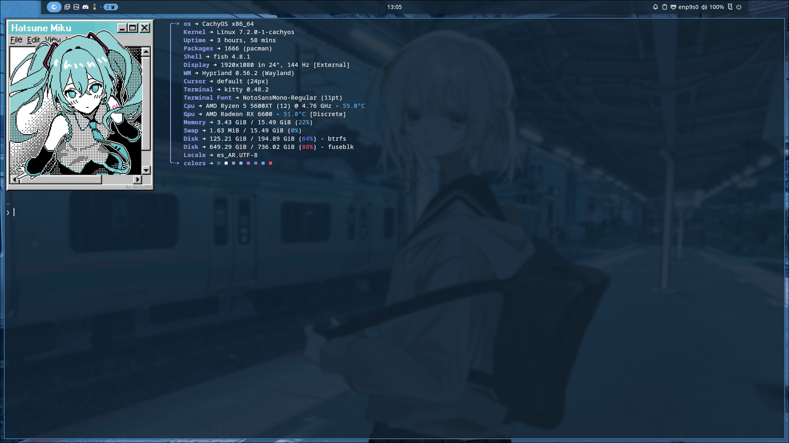
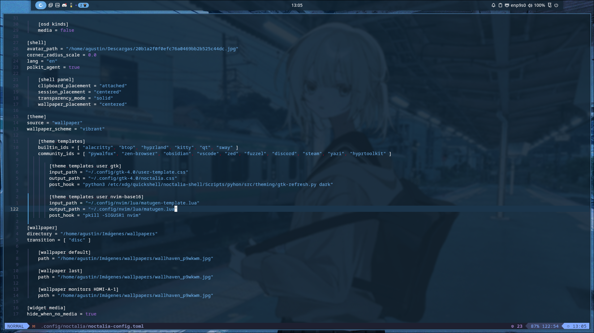
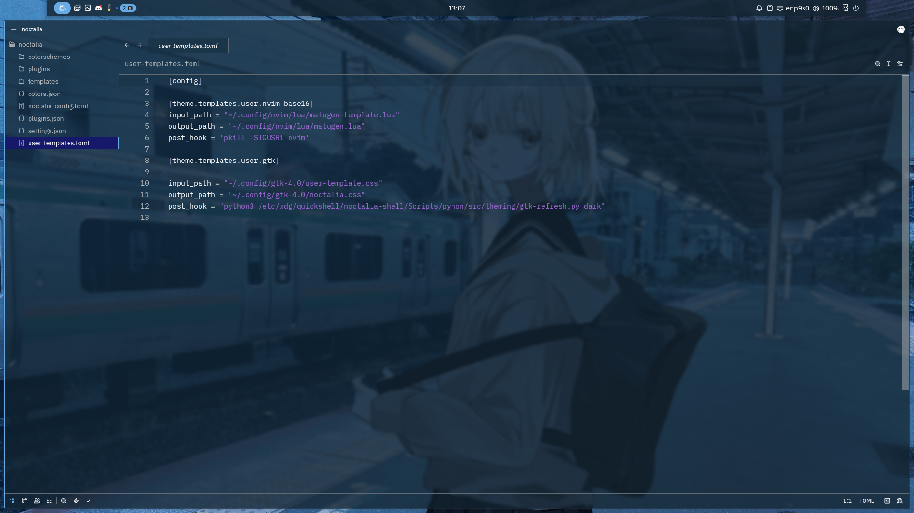

# My hyprland + noctalia dotfiles

## Kitty

## Neovim

## Zed

## Nautilis (gtk 4.0) & Firefox (pywalfox)
![nautilus and firefox image] (Imágenes/dotfiles screenshots/2026-08-26-130725_hyprshot.png)

## System information

+ OS: [Cachyos](https://github.com/CachyOS)
+ Window manager: [Hyprland](https://github.com/hyprwm/Hyprland)
+ Desktop shell: [Noctalia V5](https://github.com/noctalia-dev/noctalia)
+ Shell: [Fish](https://github.com/fish-shell/fish-shell)
+ Greeter: [Noctalia Greeter](https://github.com/noctalia-dev/noctalia-greeter)
+ Terminal: [Kitty](https://github.com/kovidgoyal/kitty)
+ Editors: [Neovim](https://github.com/neovim/neovim) & [Zed](https://github.com/zed-industries/zed)
+ Browser: [Firefox (pywalfox)](https://github.com/Frewacom/pywalfox)
